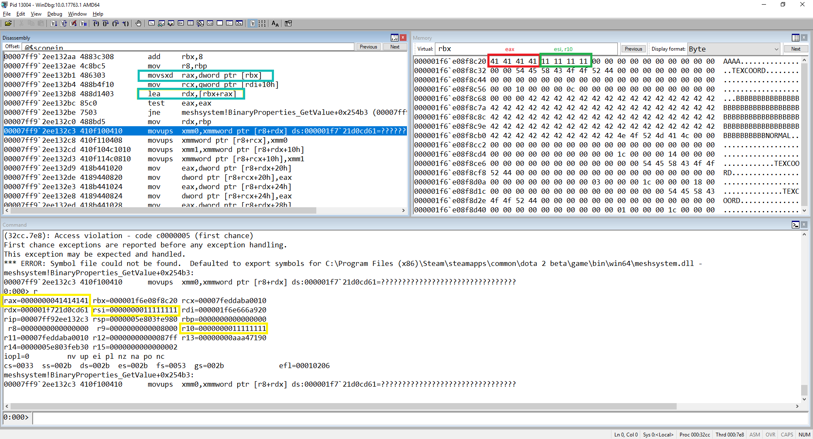

# CVE-2020-7950

Valve Dota 2 (meshsystem.dll) before 7.23f allows remote attackers to achieve code execution or denial of service by creating a gaming server and inviting a victim to this server, because a crafted map is mishandled during a GetValue call.

Attacker need invite a victim to play on attacker game server using specially crafted map or create custom game, then when initialize the game of the victim, the specially crafted map will be automatically downloaded and processed by the victim, which will lead to the possibility to exploit vulnerability. Also attacker can create custom map and upload it to [Steam](https://steamcommunity.com/sharedfiles/filedetails/?id=328258382).

## Steps for reproduce:

1) Copy attached file [zuff.vpk](zuff.vpk) to map directory (C:\Program Files (x86)\Steam\steamapps\common\dota 2 beta\game\dota\maps)
2) Launch Dota2
3) Launch "zuff" map from Dota2 game console. Command for game console = map zuff
4) Dota2 is crash (Access Violation)

## Debug information:

```
(32cc.7e8): Access violation - code c0000005 (first chance)
First chance exceptions are reported before any exception handling.
This exception may be expected and handled.
*** ERROR: Symbol file could not be found.  Defaulted to export symbols for C:\Program Files (x86)\Steam\steamapps\common\dota 2 beta\game\bin\win64\meshsystem.dll - 
meshsystem!BinaryProperties_GetValue+0x254b3:
00007ff9`2ee132c3 410f100410      movups  xmm0,xmmword ptr [r8+rdx] ds:000001f7`21d0cd61=????????????????????????????????
0:000> r
rax=0000000041414141 rbx=000001f6e08f8c20 rcx=00007feddaba0010
rdx=000001f721d0cd61 rsi=0000000011111111 rdi=000001f6e666a920
rip=00007ff92ee132c3 rsp=0000005e803fe980 rbp=0000000000000000
 r8=0000000000000000  r9=0000000000008000 r10=0000000011111111
r11=00007feddaba0010 r12=00000000000087ff r13=00000000aaa47190
r14=0000005e803feb30 r15=0000000000000002
iopl=0         nv up ei pl nz na po nc
cs=0033  ss=002b  ds=002b  es=002b  fs=0053  gs=002b             efl=00010206
meshsystem!BinaryProperties_GetValue+0x254b3:
00007ff9`2ee132c3 410f100410      movups  xmm0,xmmword ptr [r8+rdx] ds:000001f7`21d0cd61=????????????????????????????????

0:000> .load msec.dll
0:000> !exploitable

!exploitable 1.6.0.0
*** ERROR: Symbol file could not be found.  Defaulted to export symbols for C:\Program Files (x86)\Steam\steamapps\common\dota 2 beta\game\bin\win64\resourcesystem.dll - 
*** ERROR: Symbol file could not be found.  Defaulted to export symbols for C:\Program Files (x86)\Steam\steamapps\common\dota 2 beta\game\bin\win64\filesystem_stdio.dll - 
*** ERROR: Symbol file could not be found.  Defaulted to export symbols for C:\Program Files (x86)\Steam\steamapps\common\dota 2 beta\game\bin\win64\engine2.dll - 
*** ERROR: Symbol file could not be found.  Defaulted to export symbols for C:\Program Files (x86)\Steam\steamapps\common\dota 2 beta\game\bin\win64\dota2.exe - 
Exploitability Classification: PROBABLY_EXPLOITABLE
Recommended Bug Title: Probably Exploitable - Data from Faulting Address controls subsequent Write Address starting at meshsystem!BinaryProperties_GetValue+0x00000000000254b3 (Hash=0xd5611c48.0x939c36b3)

The data from the faulting address is later used as the target for a later write.
```

[Full debug information](dbginfo.txt)

### Code near exception:

```
00007ff9`2ee132b1 486303          movsxd  rax,dword ptr [rbx]
00007ff9`2ee132b4 488b4f10        mov     rcx,qword ptr [rdi+10h]
00007ff9`2ee132b8 488d1403        lea     rdx,[rbx+rax]
00007ff9`2ee132bc 85c0            test    eax,eax
00007ff9`2ee132be 7503            jne     meshsystem!BinaryProperties_GetValue+0x254b3 (00007ff9`2ee132c3)
00007ff9`2ee132c0 488bd5          mov     rdx,rbp
00007ff9`2ee132c3 410f100410      movups  xmm0,xmmword ptr [r8+rdx] ds:000001f7`21d0cd61=????????????????????????????????
```

## Description

We have full control for this exception, it can be seen from the code near the exception:
The register rbx pointing to the area of memory controlled by us! 



`00007ff92ee132b1 486303 movsxd rax,dword ptr [rbx]` - move 0x41414141 to rax

`00007ff92ee132b8 488d1403 lea rdx,[rbx+rax]` - rbx add rax and value move to rdx (The register rbx ponting to the area of memory controlled by us and we have control for rax = 0x41414141)

`00007ff92ee132c3 410f100410 movups xmm0,xmmword ptr [r8+rdx] ds:000001f721d0cd61=???????????????????????????????? - Exception (r8 = 0)` This means that we have full control of the address for exception.

This allows us to intercept the program flow what could lead to remote code execution if attacker will host a malicious server, will be able compromise a remote client by having them download a custom map or addon, triggering remote code execution on the victim's computer. Also we have control the dword of the registers rsi and r10 it could help for exploitation this vulnerability.

If extract zuff.vpk then in directory zuff\maps\zuff\worldnodes locate file node000_layer0_b133_mesh_base.vmesh_c. Modifying for this file does exception.

node000_layer0_b133_mesh_base.vmesh_c - offset for rax value is 0x620 
node000_layer0_b133_mesh_base.vmesh_c - offset for rsi and r10 values is 0x624 


Sample for this report [node000_layer0_b133_mesh_base.vmesh_c](node000_layer0_b133_mesh_base.vmesh_c)

##Timeline:

13.07.2019 - Report to hackerone

- ignore

- ignore

- ignore

24.01.2020 - Disclose vulnerability details


