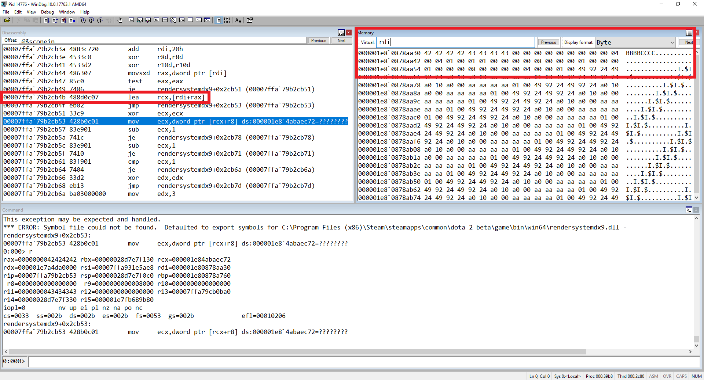

# CVE-2020-7952

Valve Dota 2 (rendersystemdx9.dll) before 7.23f allows remote attackers to achieve code execution or denial of service by creating a gaming server and inviting a victim to this server.


Attacker need invite a victim to play on attacker game server using specially crafted map or create custom game, then when initialize the game of the victim, the specially crafted map will be automatically downloaded and processed by the victim, which will lead to the possibility to exploit vulnerability. Also attacker can create custom map and upload it to [Steam](https://steamcommunity.com/sharedfiles/filedetails/?id=328258382).

## Steps for reproduce:

1) Copy attached file [dota.vpk](dota.zip) to map directory (C:\Program Files (x86)\Steam\steamapps\common\dota 2 beta\game\dota\maps)
2) Launch Dota2
3) Launch "dota" map from Dota2 game console. Command for game console = map dota
4) Dota2 is crash (Access Violation)

## Debug information:

```
(39b8.2c80): Access violation - code c0000005 (first chance)
First chance exceptions are reported before any exception handling.
This exception may be expected and handled.
*** ERROR: Symbol file could not be found.  Defaulted to export symbols for C:\Program Files (x86)\Steam\steamapps\common\dota 2 beta\game\bin\win64\rendersystemdx9.dll - 
rendersystemdx9+0x2cb53:
00007ffa`79b2cb53 428b0c01        mov     ecx,dword ptr [rcx+r8] ds:000001e8`4abaec72=????????
0:000> r
rax=0000000042424242 rbx=00000028d7e7f130 rcx=000001e84abaec72
rdx=000001e7a4da0000 rsi=00007ffa931e5ae8 rdi=000001e80878aa30
rip=00007ffa79b2cb53 rsp=00000028d7e7f0c0 rbp=000001e80878a760
 r8=0000000000000000  r9=0000000000008000 r10=0000000000000000
r11=0000000043434343 r12=0000000000000000 r13=00007ffa79cb0ba0
r14=00000028d7e7f330 r15=000001e7fb689b80
iopl=0         nv up ei pl nz na po nc
cs=0033  ss=002b  ds=002b  es=002b  fs=0053  gs=002b             efl=00010206
```

[Full debug information](Full_dbg_info.txt)

## Code near exception:

```
00007ffa`79b2cb4b 488d0c07        lea     rcx,[rdi+rax]
00007ffa`79b2cb4f eb02            jmp     rendersystemdx9+0x2cb53 (00007ffa`79b2cb53)
00007ffa`79b2cb51 33c9            xor     ecx,ecx
00007ffa`79b2cb53 428b0c01        mov     ecx,dword ptr [rcx+r8] ds:000001e8`4abaec72=????????
```


## Description

This means that in the instruction for the address 00007ffa79b2cb4b we generate the value of the rcx register from the sum of rdi and rax. The rdi register pointing to the area of memory controlled by us; we have full control the dword of the rax register.



This allows us to intercept the program flow what could lead to remote code execution if attacker will host a malicious server, will be able compromise a remote client by having them download a custom map or addon, triggering remote code execution on the victim's computer. Also we have control the dword of the register r11 it could help for exploitation this vulnerability.

## Timeline:

23.04.2019 - Report to hackerone

- ignore

- ignore

- ignore

24.01.2020 - Disclose vulnerability details


### State for report for this vulnerability for hackerone still "triaged"


